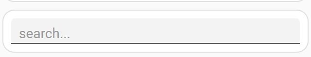
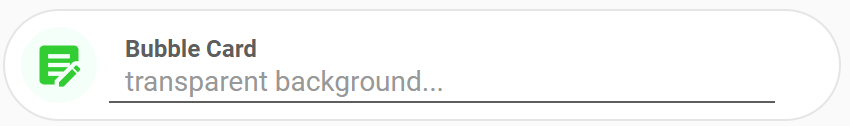
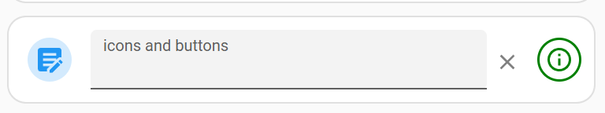
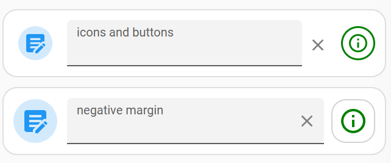
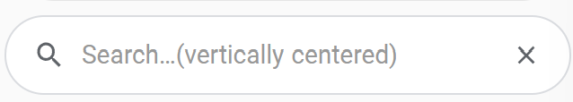
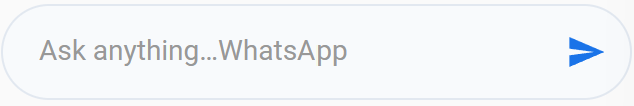
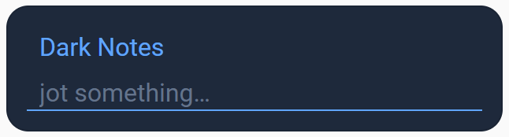

# Super Text Input Card for Home Assistant

I hate the default text_input card. It's huge, ugly and the onblur update (i.e. only triggers update when you leave the field) is annoying. Especially on mobile. I wanted a replacement that was compact, flexible, could easily be styled and had icon(s)/button(s).

**So, I made one.** A highly customizable text input card that provides real-time updates (as well as old fashioned onblur), buttons (and actions), advanced styling options and more. It also supports firing events after text updates, to save on creating automations. It supports text entities as well as text_input entities.


<br><br>
See [credits](#credits) below. This was my first attempt at a custom card. My first public repository.

## Features
- Real-time or on-blur text updates (no more focus blink in real-time mode — the input keeps focus across re-renders)
- Configurable buttons with icons, custom shapes, and tap actions
- Card- and editor-level styling: background, border, padding, height, fonts, colors, underline color
- Floated, compact label (or hide it entirely for a slim single-row look)
- Vertical alignment of the value text (top / center / bottom)
- Optional **compact buttons** mode that strips Material Design's 48 px touch target
- Per-button **border-radius** that also reshapes the hover/ripple overlay
- Underscore (`margin_left`) and hyphen (`margin-left`) YAML keys both accepted
- Supports text entities and text_input entities
- Debounced updates to prevent excessive service calls
- Compatible with HA 2026.4+ (Web Awesome `wa-input`) **and** older HA (MDC `ha-textfield`)

## What's new in v0.3

v0.3 is a big update. The card has been rewritten for Home Assistant 2026.4+, which replaced the MDC `ha-textfield` internals with Web Awesome's `wa-input`. The old version stopped rendering on 2026.4 — v0.3 detects which input element your HA exposes and styles it accordingly, so the same YAML works on both old and new HA.

Along the way the card picked up a much larger style vocabulary, slim-mode rendering, and per-button hover-shape customization. See the [Style reference](#style-reference) for the full list of keys.

The two original GitHub issues (real-time mode keyboard close on iPhone, space key not registering) are also fixed — both were symptoms of the same render-time DOM replacement, now solved by switching `render()` to a real Lit template.

## ⚠️ Breaking changes

Most existing YAML continues to work. A few defaults shifted:

- **Default card height** is now `56 px` when a label is shown, `44 px` when `hide_label: true`. If you set `style.card.height`, that wins.
- **Default editor height** is now `100%` of the card's inner area (was a fixed `36 px`). Set `style.editor.height` to override.
- **Default editor padding-bottom** is `2 px`. The legacy negative-margin trick (`margin-bottom: -3 px`) is no longer the default — you can still set it explicitly.
- **Label rendering** is now a compact floated label by default (`font-size: 10 px`, tight padding). Set `style.editor.label-font-size` and `label-padding-*` to customize.
- **`compact_buttons`** is a new card-level flag that tightens the spacing around buttons. By default every Material Design button reserves a 48×48 px touch-target, which makes shrunken icon buttons sit in much more empty space than you'd expect. `compact_buttons: true` strips that empty padding so the button hit area matches the visible icon — useful for slim pills and tight rows. It defaults to `false` so existing layouts and touch accessibility are preserved.
- **Hover overlay shape now follows the button.** Independent of `compact_buttons`, any button under 48 px now has its hover/ripple overlay scoped to the visible button (was always a 48 px circle before), and the overlay's corners follow the button's `border-radius` — set `border-radius: 12 px` and the hover becomes a rounded square instead of a circle.

If you were on v0.1 or v0.2 and your card looked exactly the way you wanted, double-check it after upgrading — small pixel shifts are possible. Everything is overridable.

## Installation (not in HACS, yet…)

1. Download the files to your `config/www/community/super-text-input/` directory.
2. Add the resource in your dashboard configuration. Two ways:
    - **Using the UI:** _Settings_ → _Dashboards_ → _More Options icon_ → _Resources_ → _Add Resource_ → Set _Url_ to `/local/community/super-text-input/super-text-input.js` → Set _Resource type_ to `JavaScript Module`.
      **Note:** If you don't see the Resources menu, enable _Advanced Mode_ in your _User Profile_.
    - **Using YAML:** add this to your `lovelace` section.
        ```yaml
        resources:
          - url: /local/community/super-text-input/super-text-input.js
            type: module
        ```

## Quick start

All props are optional except `type` and `entity`.

```yaml
type: custom:super-text-input
entity: text.some_entity   # supports input_text and text entities
name: my name              # optional friendly name
label: enter text          # floated label above the input
placeholder: text here...
update_mode: realtime      # 'realtime' or 'blur' (blur is default)
debounce_time: 1000        # ms to wait in realtime mode before pushing the value
```


A truly minimal one-liner search field:

```yaml
type: custom:super-text-input
entity: input_text.search
placeholder: search...
hide_label: true
```


## Usage

### Top-level config

| Key | Type | Default | Description |
| --- | --- | --- | --- |
| `entity` | string | _required_ | `input_text.*` or `text.*` entity |
| `name` | string | entity friendly name | Used as label fallback |
| `label` | string | `name` | Floated label above the value |
| `placeholder` | string | `""` | Shown when the value is empty |
| `update_mode` | `"blur"` \| `"realtime"` | `"blur"` | When to push the value to HA |
| `debounce_time` | number (ms) | `1000` | Debounce delay in `realtime` mode |
| `hide_label` | bool | `false` | Slim mode — collapses to a single-row input |
| `compact_buttons` | bool | `false` | Force all buttons to skip the 48 px MD touch target |
| `change_action` | action | – | Fires whenever the value changes (see [Actions](#change_action)) |
| `style` | object | – | See [Style reference](#style-reference) |
| `buttons` | array | – | See [Icons and buttons](#icons-and-buttons) |

### Card and editor styling

```yaml
- type: custom:super-text-input
  entity: input_text.sti_test
  label: Bubble Card
  placeholder: transparent background...
  buttons:
    - id: toast
      icon: mdi:text-box-edit
      position: start
      size: 38px
      icon_size: 26px
      style:
        border_radius: 50%
        background: mintcream
        color: limegreen
      tap_action:
        action: fire-dom-event
        browser_mod:
          service: browser_mod.notification
          data:
            message: 'Your toast: {{value}}'
  style:
    card:
      height: 56px
      padding: 8px
      margin: 0px
      background: white
      border-radius: 28px
      border: 1px solid rgba(0,0,0,0.1)
    editor:
      height: 100%
      background: transparent
      padding-left: 8px
      label-font-size: 12px     
      label-font-weight: 600
      margin-left: 6px
      margin-right: 24px
```

BubbleCard-esque: </br>



### Style reference

All keys accept either hyphenated CSS form (`padding-left`) or underscored (`padding_left`) — they are normalized at config-load time.

#### `style.card`

| Key | Default | Notes |
| --- | --- | --- |
| `height` | `56px` (or `44px` when `hide_label: true`) | Outer card height |
| `padding` | `8px` | Inset around the editor + buttons |
| `background` | – | Card background |
| `border-radius` | – | Card corner radius |
| `border` | – | Full CSS border shorthand |

#### `style.editor`

| Key | Default | Notes |
| --- | --- | --- |
| `height` | `100%` | Height of the input area inside the card |
| `background` | – | Editor area background |
| `color` | – | Value text color |
| `font-size` | – | Value text size |
| `font-weight` | – | Value text weight |
| `placeholder-color` | – | Placeholder color |
| `padding-left` | `8px` | Where the value text starts horizontally |
| `padding-right` | mirror of `padding-left` if only L set | Right inset |
| `padding-top` | `20px` if label shown, none otherwise | Vertical inset above the value |
| `padding-bottom` | `2px` | Gap above the underline |
| `line-gap` | – | Alias for `padding-bottom` (visual intent) |
| `padding` | – | Shorthand. Long-hand keys override per-side. |
| `vertical-align` | `bottom` | `top` / `center`(`middle`) / `bottom`. Use `center` in slim/hide_label cards |
| `margin-left`, `margin-right`, `margin-top`, `margin-bottom` | – | Offset the input element |
| `line-color` | – | Color of the bottom underline |
| `border-color`, `border-radius`, `border-width` | `border-radius: 4px` | Border around the editor area |
| `label-color` | – | Label color |
| `label-font-size` | `10px` (when label shown) | Label font size |
| `label-font-weight` | – | Label font weight |
| `label-line-height` | `1.2` (when label shown) | Label line height |
| `label-padding-top` | `4px` (when label shown) | Label top inset |
| `label-padding-bottom` | `0` (when label shown) | Label bottom inset |
| `label-padding-left` | `8px` (when label shown) | Label left inset (align with value) |
| `label-padding-right` | – | Label right inset |

#### `buttons[]`

| Key | Type | Notes |
| --- | --- | --- |
| `id` | string | Useful for card_mod and for the prebuilt `clear` template |
| `icon` | string | `mdi:...` icon name |
| `position` | `"start"` \| `"end"` | Side of the input the button sits on |
| `size` | css length | Default `36px`. Sub-48 sizes auto-trigger ripple-shape correction |
| `icon_size` | css length | Default `24px` |
| `entity` | string | If set, used as the target for `template: more-info` |
| `template` | `"clear"` \| `"toast"` \| `"more-info"` | Built-in actions (see [Actions](#built-in-button-templates)) |
| `tap_action` | action | Custom action. Overrides `template`. |
| `style` | object | Per-button styling (below) |

#### `buttons[].style`

| Key | Default | Notes |
| --- | --- | --- |
| `color` | `var(--blue-color)` | Icon color |
| `background` | `rgb(from <color> r g b / 0.2)` | Button background |
| `border` | `none` | CSS border shorthand |
| `border-radius` | `50%` | Button shape. Also propagates to the hover/ripple overlay. |
| `margin-left`, `margin-right` | auto-computed from size | Fine-tune positioning |

## Actions

### `change_action`

Fires whenever the entity's value changes. Takes a standard HA action and supports a `{{ value }}` template — useful for kicking off searches or media queries without writing a separate automation.

```yaml
change_action:
  action: call-service
  service: script.mass_media_search
  data:
    search_param: "{{ value }}"
    media_type: playlist
    sensor_id: ma_mqtt_sensor
    media_player: MA Connect Basement
```

### Per-button `tap_action`

Any standard HA action works. For example, a button that fires a `browser_mod` toast with the current value:

```yaml
buttons:
  - id: toast
    icon: mdi:bell
    tap_action:
      action: fire-dom-event
      browser_mod:
        service: browser_mod.notification
        data:
          message: "You said: {{ value }}"
```

### Built-in button templates

Three actions are common enough that the card ships them as named templates. Set `template:` on the button instead of `tap_action`:

| Template | What it does |
| --- | --- |
| `clear` | Sets the entity's value back to `""` |
| `toast` | Fires a `browser_mod` notification with the current `{{ value }}` |
| `more-info` | Opens the more-info dialog for the card's entity (or the button's own `entity` if set) |

`tap_action` overrides `template` if both are set. If neither is set, the button has no action (decorative).

## Icons and buttons

Buttons live at `start` (left of the input) or `end` (right). You can mix sizes, shapes and actions freely.

```yaml
  compact_buttons: false
  buttons:
    - id: edit
      icon: mdi:text-box-edit
      position: start
      size: 28px
      icon_size: 20px
      
    - id: clear
      icon: mdi:close
      position: end
      size: 22px
      icon_size: 16px
      template: clear
      style:
        background: transparent
        color: grey
        margin_left: 2px
        margin_right: 4px
    - id: info
      icon: mdi:information-outline
      position: end
      size: 28px
      icon_size: 18px
      template: more-info
      style:
        background: transparent
        color: green
        border: 1.5px solid green
        margin_left: 4px
        margin_right: 0px
```



#### Hover/ripple shape

The MD hover overlay used to always be a circle, even when the button was a rounded rectangle. v0.3 fixes this:

- Any button with `size: < 48 px` automatically gets its inner hover overlay shrunk to match
- The hover overlay's `border-radius` follows the button's `style.border-radius` — set `border-radius: 12 px` and the hover becomes a rounded square instead of a circle
- Card-level `compact_buttons: true` forces all buttons (regardless of size) to behave this way

## Recipes

Four common looks. The full set lives in [`sample-yaml.yaml`](sample-yaml.yaml).

### 1. Icons + green-bordered info button

Normal MD-sized buttons, with a decorative bordered info button on the right.



```yaml
type: custom:super-text-input
entity: input_text.sti_test
label: icons and buttons
buttons:
  - id: edit
    icon: mdi:text-box-edit
    position: start
    size: 28px
    icon_size: 20px
  - id: clear
    icon: mdi:close
    position: end
    size: 22px
    icon_size: 16px
    template: clear
    style:
      background: transparent
      color: grey
      margin-left: 2px
      margin-right: 4px
  - id: info
    icon: mdi:information-outline
    position: end
    size: 28px
    icon_size: 18px
    template: more-info
    style:
      background: transparent
      color: green
      border: 1.5px solid green
      margin-left: 4px
      margin-right: 0px
```

### 2. Google-style slim search pill (vertically centered)

`hide_label: true` collapses to a single row, `vertical-align: center` puts the value text in the visual middle of the pill, and a transparent `line-color` hides the underline.



```yaml
type: custom:super-text-input
entity: input_text.sti_test
placeholder: Search…
hide_label: true
compact_buttons: true
buttons:
  - id: l
    icon: mdi:magnify
    position: start
    size: 28px
    icon_size: 18px
    style:
      background: transparent
      color: '#5f6368'
      padding-right: 0px
  - id: x
    icon: mdi:close
    position: end
    size: 28px
    icon_size: 16px
    template: clear
    style:
      background: transparent
      color: '#5f6368'
style:
  card:
    height: 44px
    padding: 6px
    border-radius: 22px
    border: '1px solid #dadce0'
  editor:
    vertical-align: center
    height: 32px
    background: transparent
    padding-left: 0px
    padding-right: 4px
    line-color: transparent
    margin-left: 0px
```

### 3. WhatsApp-style chat pill

Trailing send button only. Slim, rounded, no visible underline.



```yaml
type: custom:super-text-input
entity: input_text.sti_test
placeholder: Ask anything…
hide_label: true
compact_buttons: true
buttons:
  - id: s
    icon: mdi:send
    position: end
    size: 32px
    icon_size: 20px
    style:
      background: transparent
      color: '#1a73e8'
style:
  card:
    height: 48px
    padding: 4px
    background: '#f8fafc'
    border-radius: 24px
    border: '1px solid #e2e8f0'
  editor:
    height: 100%
    background: transparent
    padding-left: 14px
    padding-right: 4px
    padding-bottom: 11px
    line-color: transparent
```

### 4. Dark notes

Dark card, blue label and underline, light value text.



```yaml
type: custom:super-text-input
entity: input_text.sti_test
label: Dark Notes
placeholder: jot something…
style:
  card:
    height: 80px
    padding: 12px
    background: '#1e293b'
    border-radius: 14px
  editor:
    background: transparent
    label-color: '#60a5fa'
    label-font-size: 16px
    font-size: 16px
    color: '#f1f5f9'
    placeholder-color: '#64748b'
    line-color: '#60a5fa'
```

## Forward-compatibility notes

The card reaches into Home Assistant's shadow DOM in a few places. These should be stable across point releases but **could** break if HA refactors the underlying elements:

- The label-styling rule targets `label.label` inside `wa-input`'s shadow — a CSS class, not an exposed part. If Web Awesome renames the class, all label styling silently no-ops until this card is updated.
- The underline (`line-color`) is drawn via `[part="base"]::after`. If wa-input switches to a `border-bottom` or a real DOM node, `line-color` becomes a no-op.
- The hover-shape correction styles `ha-button::after, ha-button::before`. If HA swaps to `mwc-ripple` / `md-ripple` or renames the pseudo, hover reverts to its default 50% circle.

In each case the card itself keeps working — only the affected style key loses effect.

## Credits

The core card was inspired by [gadgetchnnel/lovelace-text-input-row](https://github.com/gadgetchnnel/lovelace-text-input-row/) and the config options were inspired by [delphiki../base-editor.js](https://github.com/delphiki/lovelace-pronote/blob/742076718f49f4557aee77ebd36bc0dbdd3ad281/src/editors/base-editor.js).

The HA 2026.4+ compatibility work draws on [PR #4 by @DavidCeliis](https://github.com/skavan/super-text-input/pull/4).
